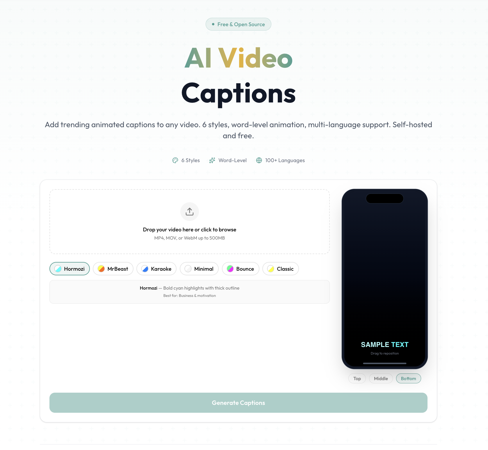

  <h1 align="center">Weekie AI Captions Generator</h1>
  

    Professional AI video caption generator. 
    Add trending animated subtitles to any video — 6 styles, word-level animation, 100+ languages. 
    Self-hosted & private. No limits.
  

  
  

  

## What It Does

Drop in any video and Weekie AI Captions Generator will:

1. **Transcribe** it using faster-whisper with word-level timestamps
2. **Generate** animated ASS subtitles in the style you chose
3. **Burn** captions directly into the video with FFmpeg
4. **Deliver** a ready-to-post captioned video in full HD

No tracking. No limits. Self-hosted and 100% private.

## Features

- **6 Trending Caption Styles** — Hormozi, MrBeast, Karaoke, Minimal, Bounce, Classic — inspired by top-performing short-form content
- **Word-Level Animation** — Each word animates individually with highlights, wipes, bounces, and scale effects
- **100+ Languages** — Automatic language detection with script-aware font fallback (Latin, CJK, Arabic, Devanagari, and more)
- **Live Preview** — See your chosen caption style on a phone mockup before processing
- **Adjustable Position** — Drag captions to the exact vertical position you want
- **HD Export** — CRF 18 quality with original audio preserved
- **Job History** — Browse all your captioned videos with status and metadata

## Tech Stack

| Layer | Technology |
|-------|-----------|
| Frontend | Next.js 16 (React 19, Tailwind CSS v4, shadcn/ui) |
| Backend | Python 3.11+, Flask, faster-whisper, pysubs2 |
| Video | FFmpeg (subtitle burn-in, encoding) |
| Database | SQLite via Prisma |
| Deployment | Docker Compose |

---

Built by **Weekie AI Captions Generator**.

